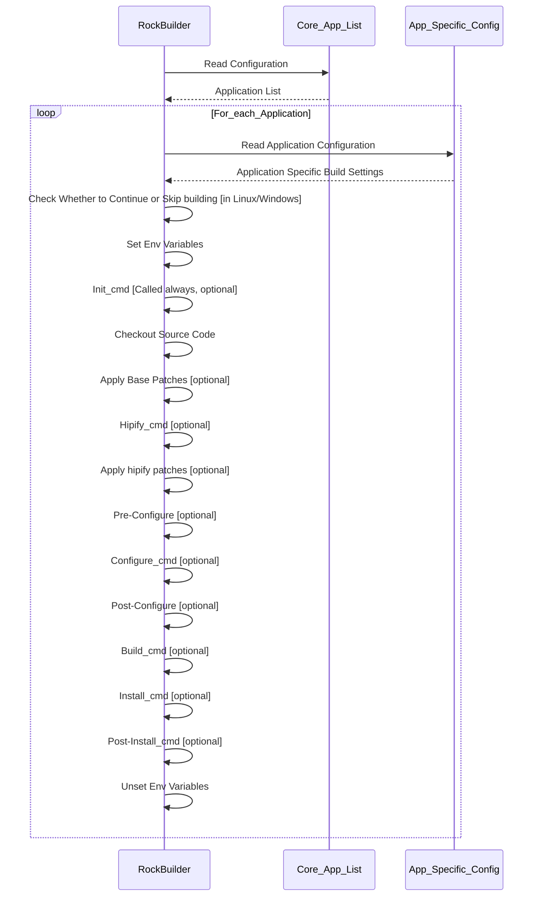

# RockBuilder Configuration

RockBuilder uses configuration files to specify the list of applications and libraries to be built.
Each application has its own configuration file, which specifies build-related parameters.

RockBuilder configuration files use an INI-style format with section names
and key-value pairs, which are supported by tools such as Python’s `ConfigParser` module.

Example RockBuilder Command Execution Sequence:



## Core Application List Configuration

The **Core Project List** specifies the applications that RockBuilder will build by default. It is defined in the following file:

```
apps/core.apps
```

Example content of the file specifying four applications to be built by default:

```
[apps]
app_list=
    pytorch
    pytorch_vision
    pytorch_audio
    torch_migraphx
```

## Application Configuration

Each application has its own INI-format configuration file that defines build options under the `[app_info]` section.

Build options can be categorized into the following:

- Application Base Information
- Environment Variables
- Build Phase Commands
- CMake Build Support

Depending on the application, build options for Linux and Windows may be the same or different. RockBuilder supports both via configuration files.

### Application Base Information

Application base information settings are mandatory. They specify the name, source code repository URL and the version to be checked out, built, and installed.

Example of core mandatory settings:

```
[application_info]
name=pytorch
repo_url=https://github.com/pytorch/pytorch.git
version=v2.7.0
```

You can also specify whether to skip building the application on Linux or Windows using the following optional settings:


PROP_DISABLE=[YES/NO/1/0]```
PROP_DISABLE_LINUX=[YES/NO/1/0]
PROP_DISABLE_WINDOWS=[YES/NO/1/0]
```

### Environment Variables

RockBuilder supports the use of environment variables in application configuration settings.

These variables are set for each application when its build process starts, and are then reset to their original values once the build process finishes.

#### Base Environment Variables

Base environment variables are automatically specified for each application that are build. These variables can be referenced in the application-specific configuration files:

- `ROCM_HOME`:
  The ROCm SDK install prefix directory
- `ROCM_PATH`:
  The ROCm SDK install prefix directory. Same value than ROCM_HOME
- `DEVICE_LIB_PATH`:
  Directory containing gpu specific bitcode (\*.bc) files
- `RCB_APP_SRC_DIR`:
  The source code directory for the currently built application
- `RCB_APP_BUILD_DIR`:
  The build directory for the currently built application
- `RCB_APP_VERSION`:
  Version or git hash code for the currently built application.
- `CLANG_HOME_DIR`:
  Home directory for the clang. It location may vary depending whether the rocm_sdk used is build locally or used from the rocm_sdk python wheels.
- `HIPCC_HOME_DIR`:
  Home directory for the hipcc. It location may vary depending whether the rocm_sdk used is build locally or used from the rocm_sdk python wheels.

#### Application-Specific Environment Variables

You can also define additional application specific environment variables, such as those for selecting a compiler or enabling/disabling build features.

RockBuilder will first set common environment variables (if defined), followed by OS-specific settings (Linux/Windows).

Example:

```
ENV_VAR  = USE_ROCM=1
ENV_VAR_WINDOWS = USE_FLASH_ATTENTION=1
ENV_VAR_LINUX   = USE_FLASH_ATTENTION=0
```

### Build Phase Commands

In addition to supporting configure, build, and install phases for CMake-based applications,
RockBuilder allows defining **custom build phase commands**.

The following optional build phase commands are supported:

- `CMD_CLEAN`
- `CMD_HIPIFY`
- `CMD_INIT`
- `CMD_PRE_CONFIG`
- `CMD_CONFIG`
- `CMD_POST_CONFIG`
- `CMD_BUILD`
- `CMD_INSTALL`
- `CMD_POST_INSTALL`

Each command can be a single command or a sequence of commands.

Example:

```
CMD_INIT = python3 -m pip install -r ./requirements.txt
CMD_CLEAN = python3 setup.py clean
CMD_HIPIFY = python3 tools/amd_build/build_amd.py
CMD_BUILD = python3 setup.py bdist_wheel
```

Example of a sequence of commands:

```
CMD_INSTALL = cd ${ROCM_HOME}/share/amd_smi
              pip3 install .
```

#### Command Execution Directory

By default, build phase commands are executed from the root directory where application's source code has been checked out.
You can override this by specifying the `CMD_EXEC_DIR` in the configuration:

```
# Execute from the 'py' subdirectory
CMD_EXEC_DIR=${RCB_APP_SRC_DIR}/py
```

#### Note About the HIPIFY Command

The `CMD_HIPIFY` is somewhat special compared to other commands.
It is partially tied to the source code checkout phase, where patches are split into:

- Base patches (applied immediately after checkout)
- HIPIFY patches (applied after the hipify command is run)

If a hipify command is specified, the execution flow is:

1. Source code checkout
1. Tagging of source code base
1. Applying base patches
1. Executing `CMD_HIPIFY`
1. Tagging HIPIFY patches

The ROCm SDK provides a hipify tool that converts CUDA files and APIs to ROCm-compatible equivalents.
Some applications, like PyTorch, can also provide their own HIPIFY command.

HIPIFY command example for the PyTorch project:

```
CMD_HIPIFY = python tools/amd_build/build_amd.py
```

HIPIFIED patches are applied from the directory:

```
patches/<application_name>/<application_version>/<application_name>/hipified
```

#### Python Wheel Management

If application build generates a Python wheel package,
RockBuilder provides a built-in command to help install and manage it:

```
ROCK_CONFIG_CMD__FIND_AND_INSTALL_LATEST_PYTHON_WHEEL <search-path>
```

This command:

1. Searches for the latest wheel in the specified path
1. Copies it to the `packages/wheels` directory
1. Installs it into the current Python environment

Note: Installing the Python wheel may be necessary to resolve build-time dependencies for other applications built later.

Example:

```
CMD_INSTALL = RCB_CALLBACK__INSTALL_PYTHON_WHEEL ${RCB_APP_SRC_DIR}/py/dist
```

### CMake Build Support

If application uses CMake, it is possible to specify the application specific cmake configuration options.

If CMD_CMAKE_CONFIG option is specified from the applications configure file, it will indicate for the RockBuilder that it should also execute the configure, build and install commands by using the cmake.

CMake build command support does not prevent using also the phase commands in parallel. For example the amdsmi application consist of both from the c-code based library handled by the cmake and python specific code handled by the python installer.

Example:

```
CMD_CMAKE_CONFIG=-DCMAKE_INSTALL_PREFIX=${ROCM_HOME} ${RCB_APP_SRC_DIR}
```
