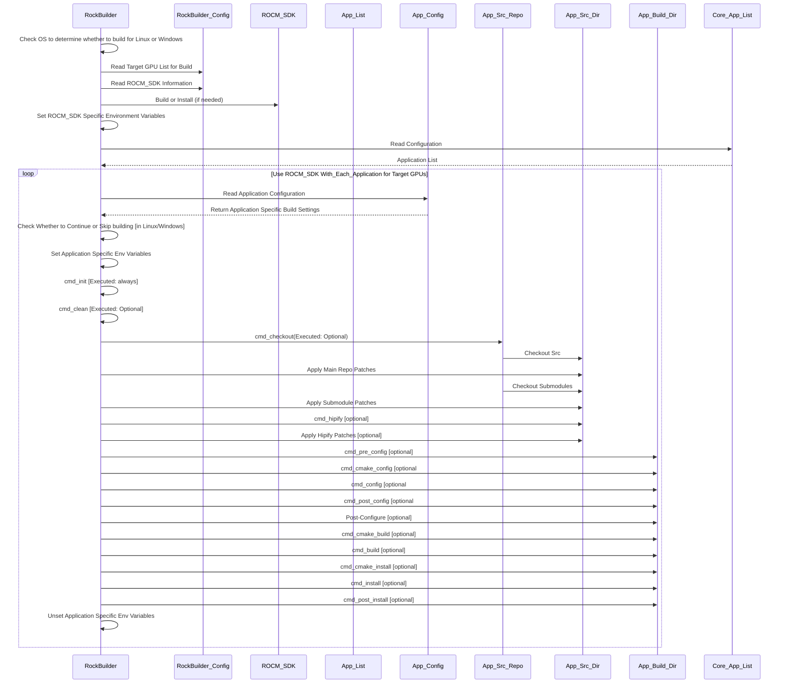

# RockBuilder Configuration Files

RockBuilder uses configuration files to specify the list of applications and libraries to be built.
Each application has its own configuration file, which specifies build-related parameters.

RockBuilder configuration files use an INI-style format with section names
and key-value pairs, which are supported by tools such as Python’s `ConfigParser` module.

RockBuilder Command Execution Sequence:


```mermaid
sequenceDiagram
    participant RockBuilder
    participant RockBuilder_Config
    participant ROCM_SDK
    participant App_List
    participant App_Config
    participant App_Src_Repo
    participant App_Src_Dir
    participant App_Build_Dir
    RockBuilder->>RockBuilder: Check OS to determine whether to build for Linux or Windows
    RockBuilder->>RockBuilder_Config: Read Target GPU List for Build
    RockBuilder->>RockBuilder_Config: Read ROCM_SDK Information
    RockBuilder->>ROCM_SDK: Build or Install (if needed)
    RockBuilder->>RockBuilder: Set ROCM_SDK Specific Environment Variables
    RockBuilder->>Core_App_List: Read Configuration
    Core_App_List-->>RockBuilder: Application List
    loop Use ROCM_SDK With_Each_Application for Target GPUs
        RockBuilder->>App_Config: Read Application Configuration
        App_Config-->>RockBuilder: Return Application Specific Build Settings
        RockBuilder->>RockBuilder: Check Whether to Continue or Skip building [in Linux/Windows]
        RockBuilder->>RockBuilder: Set Application Specific Env Variables
        RockBuilder->>RockBuilder: cmd_init [Executed: always]
        RockBuilder->>RockBuilder: cmd_clean [Executed: Optional]
        RockBuilder->>App_Src_Repo: cmd_checkout(Executed: Optional)
        App_Src_Repo->>App_Src_Dir: Checkout Src
        RockBuilder->>App_Src_Dir: Apply Main Repo Patches
        App_Src_Repo->>App_Src_Dir: Checkout Submodules
        RockBuilder->>App_Src_Dir: Apply Submodule Patches
        RockBuilder->>App_Src_Dir: cmd_hipify [optional]
        RockBuilder->>App_Src_Dir: Apply Hipify Patches [optional]
        RockBuilder->>App_Build_Dir: cmd_pre_config [optional]
        RockBuilder->>App_Build_Dir: cmd_cmake_config [optional
        RockBuilder->>App_Build_Dir: cmd_config [optional
        RockBuilder->>App_Build_Dir: cmd_post_config [optional
        RockBuilder->>App_Build_Dir: Post-Configure [optional]
        RockBuilder->>App_Build_Dir: cmd_cmake_build [optional]
        RockBuilder->>App_Build_Dir: cmd_build [optional]
        RockBuilder->>App_Build_Dir: cmd_cmake_install [optional]
        RockBuilder->>App_Build_Dir: cmd_install [optional]
        RockBuilder->>App_Build_Dir: cmd_post_install [optional]
        RockBuilder->>RockBuilder: Unset Application Specific Env Variables
    end
```

## Patches

Patches are applied for the applications from the patch files which are located
under the patches/<application_name> directory.

## Mapping of Command Line Parameters, Phase Commands and cmd_phases

Many of the Build Phase Commands maps to CMD_PHASEs specified in the RockBuilder Command Execution Sequence.
If all the phases are already done, it is also possible to re-execute the Phase Command and all Phase Commands after
it by using the command line parameter for the rockbuilder.

rockbuilder command line parameters in a following way:

| COMMAND_LINE_PARAMETER  | Phase Commands   | CMD_PHASE        |
|-------------------------|------------|------------------------|
| --init                  | CMD_INIT         | cmd_init         |
| --clean                 | CMD_CLEAN        | cmd_clean        |
| --checkout              | CMD_CHECKOUT     | cmd_checkout     |
| --hipify                | CMD_HIPIFY       | cmd_hipify       |
| --pre_config            | CMD_PRE_CONFIG   | cmd_pre_config   |
| --config                | CMD_CONFIG       | cmd_config       |
| --post_config           | CMD_POST_CONFIG  | cmd_post_config  |
| --build                 | CMD_BUILD        | cmd_build        |
| --install               | CMD_INSTALL      | cmd_install      |
| --post_install          | CMD_POST_INSTALL | cmd_post_install |

## Application List Configuration

The **Application List Configuration** can be used to specify a list of applications that RockBuilder will build. It is defined in the files ending with .apps
Application List Configuration file format is compatible with the configparser.ConfigParser from Python.


```
apps/core.apps
```

Example content of the file specifying four applications to be built by default:

```
[app_list_info]
APP_LIST=
    pytorch
    pytorch_vision
    pytorch_audio
    torch_migraphx
```

## Application Configuration

Each application to be build has it's information defined in the Application Configuration file.
This configuration file defines build options under the `[app_info]` section.
Application Configuration file format is compatible with the configparser.ConfigParser from Python.

Application configuration files are used to specify following features for the application
1) Application Base Information
2) Application Source Code Download Information
3) Operting System Compatibility Information
4) Application Specific Environment Variables
5) Application Build Phase Commands

Depending on the application, build options for Linux and Windows may be either same or different.
Application Configuration file supports setting both the common options and OS specific options.

### Application Base Information

Application base information is mandatory.
- APP_NAME specifies the applications name to be build
- APP_VERSION specifies the git tag version or hashcode used to checkout correct version from the application source code


Example of mandatory settings in application configuration file:

```
[application_info]
APP_NAME=pytorch
APP_VERSION=v2.7.0
```

### Application Source Code Download Information

Application source code download information is optional.

- REPO_URL specifies the git repository url to download the applications source code
- PROP_FETCH_REPO_TAGS specifies whether to download only the current version of source or all git tags with full git history
- PATCH_DIR specifies to the directory used for searching local patches that can be applied on top of the downloaded sources.
  If PATCH_DIR is specified, the directory location is under patches/<APP_NAME>/<PATCH_DIR>/<APP_NAME>/base
  If PATCH_DIR is not specified, the directory location is under patches/<APP_NAME>/<APP_VERSION>/<APP_NAME>/base

Example keywords and values:

```
[application_info]
REPO_URL=https://github.com/pytorch/pytorch.git
APP_VERSION=release/2.9
PATCH_DIR=rel_29
PROP_FETCH_REPO_TAGS=yes
```

### Operting System Compatibility Information

Application Configuration file can specify whether the execution of
application is not supported on Linux or Windows by using a properties

```
PROP_DISABLE=[YES/NO/1/0]
PROP_DISABLE_LINUX=[YES/NO/1/0]
PROP_DISABLE_WINDOWS=[YES/NO/1/0]
```

Example Application Configuration:

```
[application_info]
...
ENV_VAR = 
          USE_ROCM=1
          DEBUG_BUILD=0
PROP_DISABLE_WINDOWS=1
```

With these settings if if Rockbuilder is run on Linux, it would process the pytorch build cmd phases
and on Windows it would skip the execution of pytorch build cmd phases.


### Application Specific Environment Variables

You can also define additional application specific environment variables, such as those that application build system may use for selecting a compiler or enabling/disabling build features.
Following keywords can be used to specify the environment variables
- ENV_VAR specifies common environment variables used both on Linux and Windows builds
- ENV_VAR_LINUX specifies Linux specific environment variables used in addition on when rockbuilder is on Linux
- ENV_VAR_WINDOWS specifies Windows specific environment variables used in addition when rockbuilder is on Windows


RockBuilder will first set common environment variables (if defined), followed by OS-specific settings (Linux/Windows)
by defining a key which ends with _LINUX or _WINDOWS keyword.

If there is both the ENV_VAR and ENV_VAR_LINUX specified and rockbuilder is run on
Linux, then the values from ENV_VAR and ENV_VAR_LINUX are both set to environment
variables and operating system specific values will override the generic values
in conflict cases.

Example Application Configuration:

```
[application_info]
APP_NAME=pytorch
ENV_VAR = 
          USE_ROCM=1
          DEBUG_BUILD=0
ENV_VAR_LINUX = 
          USE_FLASH_ATTENTION=1
ENV_VAR_WINDOWS = 
          USE_FLASH_ATTENTION=0
          DEBUG_BUILD=1
```

If Rockbuilder is run on Linux this would set a following environment variables for the pytorch build time:

```
       USE_ROCM=1
       DEBUG_BUILD=0
       USE_FLASH_ATTENTION=1
```

If Rockbuilder is run on Windows this would set following environment variables for the pytorch build time:

```
       USE_ROCM=1
       DEBUG_BUILD=1
       USE_FLASH_ATTENTION=0
```

### Application Build Phases

RockBuilder executes a following type of sequence of commands for each application that is build.
- init: Optional phase executed always to allow user to do some actions before build starts. Rockbuilder will also in this phase ensure that build directory exist.
- clean: Optional phase executed only if user specifies the --clean parameter. This will set the source code to state where all application build phases will be executed again.
- checkout: Optional build phase executed only once to download and patch the source code.
- hipify: Optional build phase executed only once. Allows executing ROCM hipify phase after source code download and patching
- pre-configure: Optional build phase executed only once. Allows performing commands needed before configure phase.
- configure: Optional build phase executed only once. Used to execute source code configuration commands before build commands.
- build: Optional build phase executed only once. Used to execute source code build commands.
- install: Optional build phase executed only once. Used to execute source code install commands.
- build: Optional build phase executed only once. Allow user to execute some own commands after install phase.

For eaach of the build phases it is possible to set command rockbuilder will call when building the application by using a
following KEYS in the application configuration file. If build phase is optional and command is not specified, that build phase
is skipped.


#### Application Build Phase Commands

By default rockbuilder assumes that the application is using the cmake specific build system
and will call cmake for configure, build and install phases by default when executing the build phases.

But it is also possible to override the default commands used by defining some of the following
**Application Build Phase Commands**.in the application configuration file.

- CMD_INIT: Application build specific init commands that are executed always.
- CMD_CLEAN: Commands executed to clean the source code from temporarily files produced by the previous build 
- CMD_HIPIFY: Commands executed after source code checkout and CMD_CLEAN on hipify phase
  which modifies the original source code from cuda to be compatible with the rocm
- CMD_PRE_CONFIG: Commands executed after CMD_HIPIFY
- CMD_CMAKE_CONFIG: Allow user to specify CMAKE specific configuration. When this is specified, rockbuilder will automatically also use cmake for build and install commands.
- CMD_CONFIG: Commands executed after CMD_PRE_CONFIG to configure the application source code.
- CMD_POST_CONFIG: Commands executed after CMD_CONFIG.
- CMD_BUILD: Commands used to build the application from the source code
- CMD_INSTALL: Commands executed after the CMD_BUILD phase to install the application
- CMD_POST_INSTALL: Commands executed after the CMD_INSTALL phase.

Each command can be a single command or a sequence of commands.

Example:

```
CMD_INIT = python3 -m pip install -r ./requirements.txt
CMD_CLEAN = python3 setup.py clean
CMD_HIPIFY = python3 tools/amd_build/build_amd.py
CMD_BUILD = python3 setup.py bdist_wheel
```

Example of a sequence of commands:

```
CMD_INSTALL = cd ${ROCM_HOME}/share/amd_smi
              pip3 install .
```

#### Operating System Specific Build Phase Commands

It is also possible to specify operating system specific phase commands in the configuration file
by defining a key which ends with _LINUX or _WINDOWS keyword.

If there is both the CMD_INSTALL and CMD_INSTALL_LINUX specified and rockbuilder is run on
Linux, then the command specified by CMD_INSTALL_LINUX keyword has higher priority and is used.

Example of a sequence of commands:

```
CMD_INSTALL_LINUX  =echo "Installed" > ${RCB_APP_SRC_DIR}/done.txt
CMD_INSTALL_WINDOWS=echo set "Installed" > ${RCB_APP_SRC_DIR}/done.txt
```

#### CMake Build Support

If application uses CMake, it is possible to specify the application specific cmake configuration options.

If CMD_CMAKE_CONFIG option is specified from the applications configure file, it will indicate for the RockBuilder that it should also execute the configure, build and install commands by using the cmake.

CMake build command support does not prevent using also the phase commands in parallel. For example the amdsmi application consist of both from the c-code based library handled by the cmake and python specific code handled by the python installer.

Example:

```
CMD_CMAKE_CONFIG=-DCMAKE_INSTALL_PREFIX=${ROCM_HOME} ${RCB_APP_SRC_DIR}
```

#### Python Wheel Management

If application build generates a Python wheel package,
RockBuilder provides a built-in command to help install and manage it:

```
ROCK_CONFIG_CMD__FIND_AND_INSTALL_LATEST_PYTHON_WHEEL <search-path>
```

This command:

1. Searches for the latest wheel in the specified path
1. Copies it to the `packages/wheels` directory
1. Installs it into the current Python environment

Note: Installing the Python wheel may be necessary to resolve build-time dependencies for other applications built later.

Example:

```
CMD_INSTALL = RCB_CALLBACK__INSTALL_PYTHON_WHEEL ${RCB_APP_SRC_DIR}/py/dist
```

#### Command Line Parameters to Override Default Build Phase Commands

By default the rockbuilder executed each build phase command except init only once after successful execution.
It is however possible to force the same build phase to be run again in a following ways.

1) By specifying --clean parameter and then re-running the build again

Example:

```
./rockbuiolder.py apps/pytorch_29.cfg --clean
./rockbuiolder.py apps/pytorch_29.cfg
```

2) By forcing the execution of certain build phase and build phases after that to be re-run

Example:

```
./rockbuiolder.py apps/pytorch_29.cfg --build
```

### Environment Variables

RockBuilder supports the use of environment variables in values specified in the application configuration settings.

#### Base Environment Variables

Base environment variables are automatically specified for each application that are build. These variables can be referenced in the application-specific configuration files:

- `ROCM_HOME`:
  The ROCm SDK install prefix directory
- `ROCM_PATH`:
  The ROCm SDK install prefix directory. Same value than ROCM_HOME
- `DEVICE_LIB_PATH`:
  Directory containing gpu specific bitcode (\*.bc) files
- `RCB_APP_SRC_DIR`:
  The source code directory for the currently built application
- `RCB_APP_BUILD_DIR`:
  The build directory for the currently built application
- `RCB_APP_VERSION`:
  Version or git hash code for the currently built application.
- `CLANG_HOME_DIR`:
  Home directory for the clang. It location may vary depending whether the rocm_sdk used is build locally or used from the rocm_sdk python wheels.
- `HIPCC_HOME_DIR`:
  Home directory for the hipcc. It location may vary depending whether the rocm_sdk used is build locally or used from the rocm_sdk python wheels.


#### Command Execution Directory

By default, build phase commands are executed from the root directory where application's source code has been checked out.
You can override this by specifying the `CMD_EXEC_DIR` in the configuration:

```
# Execute from the 'py' subdirectory
CMD_EXEC_DIR=${RCB_APP_SRC_DIR}/py
```

#### Note About the HIPIFY Command

The `CMD_HIPIFY` is somewhat special compared to other commands.
It is partially tied to the source code checkout phase, where patches are split into:

- Base patches (applied immediately after checkout)
- HIPIFY patches (applied after the hipify command is run)

If a hipify command is specified, the execution flow is:

1. Source code checkout
1. Tagging of source code base
1. Applying base patches
1. Executing `CMD_HIPIFY`
1. Tagging HIPIFY patches

The ROCm SDK provides a hipify tool that converts CUDA files and APIs to ROCm-compatible equivalents.
Some applications, like PyTorch, can also provide their own HIPIFY command.

HIPIFY command example for the PyTorch project:

```
CMD_HIPIFY = python tools/amd_build/build_amd.py
```

HIPIFIED patches are applied from the directory:

```
patches/<application_name>/<application_version>/<application_name>/hipified
```
