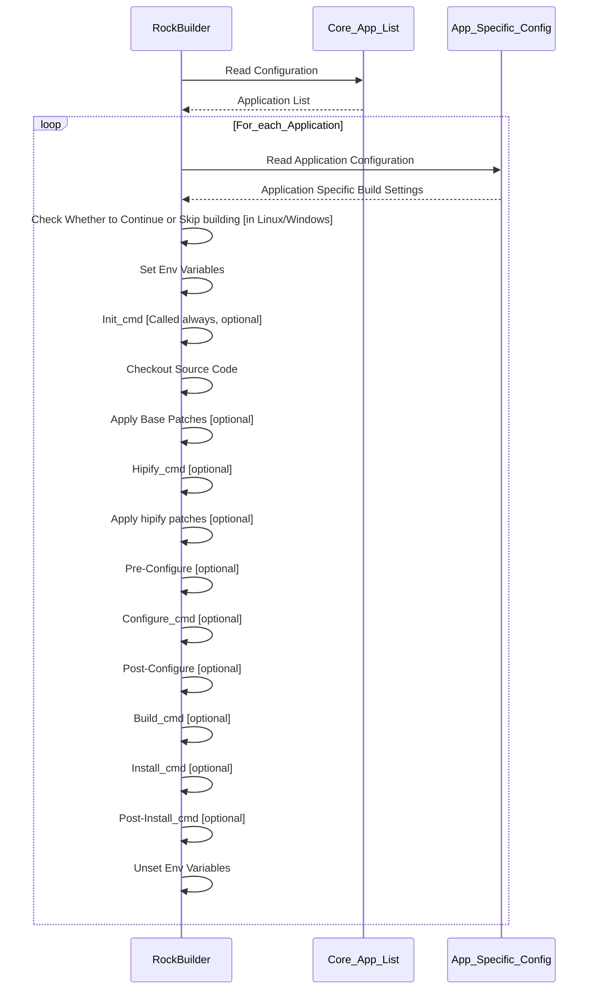

# RockBuilder Configuration

RockBuilder uses configuration files to specify the list of applications and libraries to be built.
Each application has its own configuration file, which specifies build-related parameters.

RockBuilder configuration files use an INI-style format with section names
and key-value pairs, which are supported by tools such as Python’s `ConfigParser` module.

Example RockBuilder Command Execution Sequence:


```mermaid
sequenceDiagram
    participant RockBuilder
    participant Core_App_List
    RockBuilder->>Core_App_List: Read Configuration
    Core_App_List-->>RockBuilder: Application List

    loop For_each_Application
        RockBuilder->>App_Specific_Config: Read Application Configuration
        App_Specific_Config-->>RockBuilder: Application Specific Build Settings
        RockBuilder->>RockBuilder: Check Whether to Continue or Skip building [in Linux/Windows]
        RockBuilder->>RockBuilder: Set Env Variables
        RockBuilder->>RockBuilder: Init_cmd [Called always, optional]
        RockBuilder->>RockBuilder: Checkout Source Code
        RockBuilder->>RockBuilder: Apply Base Patches [optional]
        RockBuilder->>RockBuilder: Hipify_cmd [optional]
        RockBuilder->>RockBuilder: Apply hipify patches [optional]
        RockBuilder->>RockBuilder: Pre-Configure [optional]
        RockBuilder->>RockBuilder: Configure_cmd [optional]
        RockBuilder->>RockBuilder: Post-Configure [optional]
        RockBuilder->>RockBuilder: Build_cmd [optional]
        RockBuilder->>RockBuilder: Install_cmd [optional]
        RockBuilder->>RockBuilder: Post-Install_cmd [optional]
        RockBuilder->>RockBuilder: Unset Env Variables
    end
```

## Core Application List Configuration

The **Core Project List** specifies the applications that RockBuilder will build by default. It is defined in the following file:

```
apps/core.apps
```

Example content of the file specifying four applications to be built by default:

```
[apps]
app_list=
    torch
    torchvision
    torchaudio
    torch_migraphx
```

## Application Configuration

Each application has its own INI-format configuration file that defines build options under the `[app_info]` section.

Build options can be categorized into the following:

- Application Base Information
- Environment Variables
- Build Phase Commands
- CMake Build Support

Depending on the application, build options for Linux and Windows may be the same or different. RockBuilder supports both via configuration files.

### Application Base Information

Application base information settings are mandatory. They specify the name, source code repository URL and the version to be checked out, built, and installed.

Example of core mandatory settings:

```
[application_info]
name=pytorch
repo_url=https://github.com/pytorch/pytorch.git
version=v2.7.0
```

You can also specify whether to skip building the application on Linux or Windows using the following optional settings:


PROP_DISABLE=[YES/NO/1/0]```
PROP_DISABLE_LINUX=[YES/NO/1/0]
PROP_DISABLE_WINDOWS=[YES/NO/1/0]
```

TheRock build configurations can specify an install-directory basename:

```ini
ROCM_SDK_INSTALL_DIR_BASENAME=rocm_10_0_0
```

The development configuration uses placeholders resolved after checkout:

```ini
ROCM_SDK_INSTALL_DIR_BASENAME=rocm_dev_{rocm_version}_{git_hash}
```

`rocm_version` comes from the checkout's root `version.json`. `git_hash`
comes strictly from `RCB_TAG_CHECKOUT`, before file-copy and patch commits.

### Multiple TheRock Builds

RockBuilder provides these initial TheRock configurations:

- `apps/therock_10_0.cfg`: `release/therock-10.0`
- `apps/therock_dev.cfg`: `main`

Their source and build directories are based on the configuration filename,
such as `src_apps/therock_dev` and `build/therock_dev`. Both retain
`APP_NAME=therock`, so they share common files under
`changes/files/therock/common`.

`rockbuilder.cfg` stores the selected variant separately from its resolved
installation:

```ini
[rocm_sdk]
rocm_sdk_build_config = ['therock_dev']
rocm_sdk_build = ['/opt/rcb/rocm_dev_10_1_0_a1b2c3d']
```

The path is added after a successful installation. The configuration UI
offers every valid SDK directory found directly below `/opt/rcb` and
`~/rcb`, regardless of its directory name or install marker. A valid SDK
specified by `ROCM_HOME` is also offered. Development installs are retained,
and RockBuilder does not manage a stable symlink.

### Interactive Configuration Pages

The configuration UI presents applicable registered pages in order:

1. ROCm SDK selection with Cancel and Forward buttons.
2. GPU target selection.
3. XNACK mode selection when `gfx906`, `gfx908`, `gfx90a`, `gfx942`, or
   `gfx950` is selected.
4. Sanitizer selection when RockBuilder will build TheRock.

Use Up and Down to move through selections and Space to change a selection.
When the list has focus, Enter focuses Forward or Save without changing the
selection. Enter activates a focused button. Tab moves focus between the list
and buttons, while Left and Right move between buttons. C, F, B, and S are
direct shortcuts for Cancel, Forward, Back, and Save. Esc also cancels.

Selections remain in memory while moving Back or Forward. Cancel exits without
changing `rockbuilder.cfg`; Save writes all wizard-owned sections while
preserving unrelated configuration sections.

### XNACK Target Modes

Each selected XNACK-capable target has one independent mode:

- Plain
- XNACK-
- XNACK+
- Both XNACK- and XNACK+

Space cycles the mode. Both explicit variants are stored as separate values:

```ini
[build_targets]
gpus = [
    'gfx1100',
    'gfx90a:xnack-',
    'gfx90a:xnack+',
    'gfx942:xnack+',
    ]
```

RockBuilder joins these values with semicolons when setting
`RCB_AMDGPU_TARGETS`. Plain and explicit variants of the same base target
cannot be selected simultaneously.

### TheRock Sanitizer Modes

The sanitizer page offers:

- Normal build: no sanitizer instrumentation.
- Host ASAN: host-side address sanitizer without changing GPU targets.
- Combined ASAN: host instrumentation for every selected GPU and device
  instrumentation for supported selected GPUs.

The combined option's label lists the selected targets that receive device
ASAN. It requires at least one selected `gfx906`, `gfx90a`, `gfx942`, or
`gfx950` target. Plain forms of those targets are saved as XNACK+ because
device-side ASAN requires XNACK+. XNACK- and Both modes are rejected for
the combined mode. Other selected GPUs, including `gfx908`, remain in the
target list and receive host ASAN but not device-side ASAN instrumentation.

RockBuilder's TheRock patches register the explicit XNACK target IDs and
extend TheRock's full-ASAN target transformation to `gfx906` and `gfx90a`.

The selected mode is stored explicitly, including Normal:

```ini
[build_options]
therock_sanitizer = ['NONE']
```

Other supported values are `HOST_ASAN` and `ASAN`. RockBuilder passes the
stored selection to TheRock's `rcb_config.py` through its `--sanitizer`
parameter. The parameter defaults to `None`, which disables sanitizers, and
TheRock configuration does not prompt for a sanitizer mode.

Sanitized SDK installations use `_asan` or `_host_asan` suffixes so they do
not overwrite normal SDKs. Wheel artifact paths inherit this identity from
the SDK install-directory name.

### Environment Variables

RockBuilder supports the use of environment variables in application configuration settings.

These variables are set for each application when its build process starts, and are then reset to their original values once the build process finishes.

#### Base Environment Variables

Base environment variables are automatically specified for each application that are build. These variables can be referenced in the application-specific configuration files:

- `ROCM_HOME`:
  The ROCm SDK install prefix directory
- `ROCM_PATH`:
  The ROCm SDK install prefix directory. Same value than ROCM_HOME
- `DEVICE_LIB_PATH`:
  Directory containing gpu specific bitcode (\*.bc) files
- `RCB_APP_SRC_DIR`:
  The source code directory for the currently built application
- `RCB_APP_BUILD_DIR`:
  The build directory for the currently built application
- `RCB_APP_VERSION`:
  Version or git hash code for the currently built application.
- `RCB_AMDGPU_TARGETS`:
  Semicolon-separated GPU targets, including explicit XNACK qualifiers.
- `RCB_AMDGPU_BASE_TARGETS`:
  Semicolon-separated GPU architectures without feature qualifiers. Use
  this for build systems, such as AOTriton, which accept base names only.
- `RCB_THEROCK_SANITIZER`:
  The selected `NONE`, `HOST_ASAN`, or `ASAN` TheRock build mode.
- `CLANG_HOME_DIR`:
  Home directory for the clang. It location may vary depending whether the rocm_sdk used is build locally or used from the rocm_sdk python wheels.
- `HIPCC_HOME_DIR`:
  Home directory for the hipcc. It location may vary depending whether the rocm_sdk used is build locally or used from the rocm_sdk python wheels.

#### Application-Specific Environment Variables

You can also define additional application specific environment variables, such as those for selecting a compiler or enabling/disabling build features.

RockBuilder will first set common environment variables (if defined), followed by OS-specific settings (Linux/Windows).

Example:

```
ENV_VAR  = USE_ROCM=1
ENV_VAR_WINDOWS = USE_FLASH_ATTENTION=1
ENV_VAR_LINUX   = USE_FLASH_ATTENTION=0
```

### Build Phase Commands

In addition to supporting configure, build, and install phases for CMake-based applications,
RockBuilder allows defining **custom build phase commands**.

The following optional build phase commands are supported:

- `CMD_CLEAN`
- `CMD_HIPIFY`
- `CMD_INIT`
- `CMD_PRE_CONFIG`
- `CMD_CONFIG`
- `CMD_POST_CONFIG`
- `CMD_BUILD`
- `CMD_INSTALL`
- `CMD_POST_INSTALL`

Each command can be a single command or a sequence of commands.

Example:

```
CMD_INIT = python3 -m pip install -r ./requirements.txt
CMD_CLEAN = python3 setup.py clean
CMD_HIPIFY = python3 tools/amd_build/build_amd.py
CMD_BUILD = python3 setup.py bdist_wheel
```

Example of a sequence of commands:

```
CMD_INSTALL = cd ${ROCM_HOME}/share/amd_smi
              pip3 install .
```

#### Command Execution Directory

By default, build phase commands are executed from the root directory where application's source code has been checked out.
You can override this by specifying the `CMD_EXEC_DIR` in the configuration:

```
# Execute from the 'py' subdirectory
CMD_EXEC_DIR=${RCB_APP_SRC_DIR}/py
```

#### Note About the HIPIFY Command

The `CMD_HIPIFY` is somewhat special compared to other commands.
It is partially tied to source checkout, where updates are split into copied
files, base patches, and HIPIFY patches.

- Copied files (committed immediately after checkout)
- Base patches (applied after the file-copy commit)
- HIPIFY patches (applied after the hipify command is run)

Set `RCB__USER_CHANGES_ROOT_DIR` to use one alternative changes root.
RockBuilder searches that root first, followed by its built-in `changes/`
directory. Each root contains both `files/` and `patches/` subdirectories.
Saved patches are written to the first root.

If a hipify command is specified, the execution flow is:

1. Source code checkout
2. Tag the original checkout as `RCB_TAG_CHECKOUT`
3. Copy and commit files, then tag the result as `RCB_TAG_FILE_COPY`
4. Apply base patches
5. Execute `CMD_HIPIFY`
6. Commit the HIPIFY changes
7. Apply HIPIFY patches

Files copied to every version are read from:

```
changes/files/<application_name>/common/<repository>/<destination_path>
```

Version-specific files are read from:

```
changes/files/<application_name>/<PATCH_DIR>/<repository>/<destination_path>
```

Version-specific files override common files with the same relative path.
Copied files must be new files; checkout fails if a destination already exists.
When there are no files to copy, `RCB_TAG_FILE_COPY` points to the same commit
as `RCB_TAG_CHECKOUT`.

Base patches are applied from:

```
changes/patches/<application_name>/<PATCH_DIR>/<repository>/base
```

The ROCm SDK provides a hipify tool that converts CUDA files and APIs to ROCm-compatible equivalents.
Some applications, like PyTorch, can also provide their own HIPIFY command.

HIPIFY command example for the PyTorch project:

```
CMD_HIPIFY = python tools/amd_build/build_amd.py
```

HIPIFIED patches are applied from the directory:

```
changes/patches/<application_name>/<PATCH_DIR>/<repository>/hipified
```

#### Python Wheel Management

If application build generates a Python wheel package,
RockBuilder provides a built-in command to help install and manage it:

```
RCB_CALLBACK__INSTALL_PYTHON_WHEEL <search-path>
```

This command:

1. Searches for the latest wheel in the specified path
1. Copies it below the configured wheel output directory
1. Installs it into the current Python environment

Note: Installing the Python wheel may be necessary to resolve build-time dependencies for other applications built later.

Example:

```
CMD_INSTALL = RCB_CALLBACK__INSTALL_PYTHON_WHEEL ${RCB_APP_SRC_DIR}/py/dist
```

The default wheel output layout is:

```text
packages/whl/<rocm-sdk-id>/<gpu-targets>/<application>/<wheel>
```

`<rocm-sdk-id>` is the resolved ROCm SDK installation directory name, such as
`rocm_dev_10_1_0_4144ab3`. `<gpu-targets>` contains the sorted build targets.
The `--output-dir` option changes only the output base; RockBuilder still adds
the SDK, GPU, and application directories. Existing wheel directories are not
migrated.

### CMake Build Support

If application uses CMake, it is possible to specify the application specific cmake configuration options.

If CMD_CMAKE_CONFIG option is specified from the applications configure file, it will indicate for the RockBuilder that it should also execute the configure, build and install commands by using the cmake.

CMake build command support does not prevent using also the phase commands in parallel. For example the amdsmi application consist of both from the c-code based library handled by the cmake and python specific code handled by the python installer.

Example:

```
CMD_CMAKE_CONFIG=-DCMAKE_INSTALL_PREFIX=${ROCM_HOME} ${RCB_APP_SRC_DIR}
```
