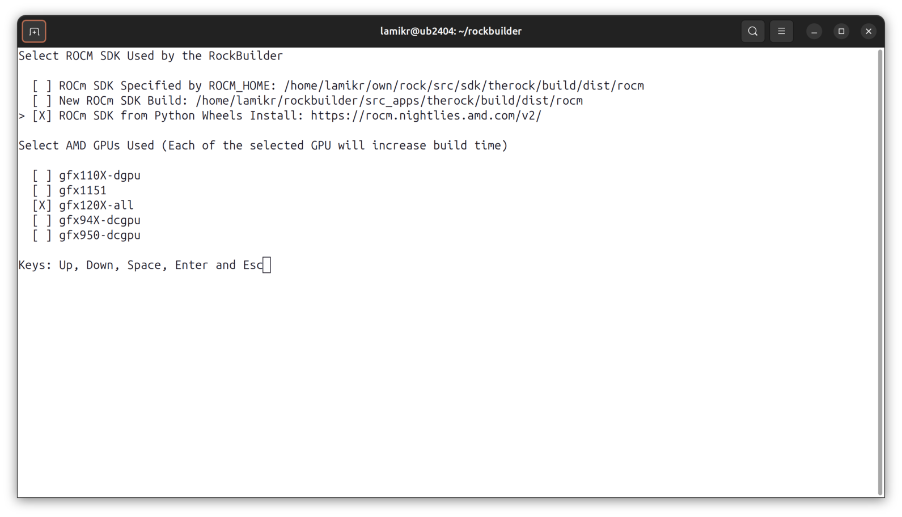

# RockBuilder

RockBuilder is a configuration-based build system that simplifies the process of integrating and building one or multiple AI applications on top of AMD’s ROCm SDK.

RockBuilder can use:

- An existing ROCm SDK installation.

- A new ROCm SDK, either:

    - Built from source, or

    - Installed from Python wheels.

RockBuilder supports both Linux and Windows for building the applications.

# Usage

## Download RockBuilder

```
git clone https://github.com/roCm/rockbuilder
```

## ROCm SDK and Target GPU Configuration

Initialize and activate the Python virtual environment with all Python dependencies required by RockBuilder:

- Linux (Ubuntu 24.04):

    ```
    cd rockbuilder
    source ./init_rcb_env.sh
    ```

- Windows (x86_64, Visual Studio Command Prompt):

    ```
    cd rockbuilder
    init_rcb_env.bat
    ```

The `init_rcb_env` script checks if the Python virtual environment is active. If not, it will initialize and activate one in **.venv-directory** and install all the Python packages required by RockBuilder.

After the Python virtual environment is activated, you can start RockBuilder:

```
python rockbuilder.py
```

When you run RockBuilder for the first time, it checks whether a `rockbuilder.cfg` configuration file exists to decide if it needs to build or install the ROCm SDK before proceeding to build applications: 

- If the file exists, RockBuilder automatically selects a stable, tested version of the ROCm SDK as the base environment, and you can proceed directly to building your applications.

- If the file does not exist, you will be prompted to choose how to install the ROCm SDK and specify your target GPUs:

    - **New ROCm SDK Build**: Lists all supported AMD GPUs.

        

    - **ROCm SDK from Python Wheels**: Lists only GPUs with available wheel packages (some GPUs may share the same package).

        

Once confirmed (by pressing **Enter**), your selections will be saved to `rockbuilder.cfg`.

> **Note:** Building the ROCm SDK allows for greater customization, but the process can take anywhere from one to several hours, depending on your system.

## Build an Application Set

In many cases, multiple applications need to be built to achieve full functionality. RockBuilder handles this by listing all related applications and their corresponding versions in an `.apps` file.

Example usage to build PyTorch nightly and its dependencies:

```
./rockbuilder.py apps/pytorch_nightly.apps
```

This will download, configure, and build all applications that are specified in the `pytorch_nightly.apps` file.

```apps/pytorch_nightly.apps
[apps]
app_list=
    deps_common
    pytorch_aotriton_nightly
    triton_pytorch_nightly
    pytorch_nightly
    pytorch_vision_nightly
    pytorch_torchcodec_nightly
    pytorch_audio_nightly
```

Applications are built and installed in the listed order above. Each application will be installed into the currently active Python virtual environment. Any additional libraries or executables built by CMake will be installed to the configured ROCm SDK.

Built Python wheels will be copied to the `packages/wheels` directory in RockBuilder.

## Build Applications One By One

Instead of building a set of applications, you can also build them one by one in the correct dependency order.

```
./rockbuilder.py apps/deps_common.cfg
./rockbuilder.py apps/pytorch_aotriton_nightly.cfg
./rockbuilder.py apps/triton_pytorch_nightly.cfg
./rockbuilder.py apps/pytorch_nightly.cfg
./rockbuilder.py apps/pytorch_vision_nightly.cfg
./rockbuilder.py apps/pytorch_torchcodec_nightly.cfg
./rockbuilder.py apps/pytorch_audio_nightly.cfg
```

Each of these `.cfg` files provides an application-specific configuration. These files define the application name, version, source repository, and the commands required to configure, build, and install the application.

Configuration file format is specified in [CONFIG.md](CONFIG.md).

## Test the Applications Build

RockBuilder includes simple example applications to verify that the PyTorch build was successful. If you are running the tests from a new terminal window, you’ll need to activate the Python virtual environment first. If it’s already active, you can skip this step:

```
source ./init_rcb_env.sh 
```

Then, run the example application itself with the following command:

```
python examples/torch_gpu_hello_world.py 
```

If successful, the application should print output similar to the following in the terminal:

```
Pytorch version: 2.8.0
ROCM HIP version: 7.1.25441-b9b1250
cuda device count: 2
default cuda device name: AMD Radeon Pro W7900 Dual Slot
device type: cuda
Tensor training running on cuda: True
Running simple model training test
    tensor([0., 1., 2.], device='cuda:0')
Hello World, test executed succesfully
```

Example output from the test applications on Windows using the AMD Radeon W7900 GPU:

```bash
(.venv) D:\rockbuilder\examples>python torch_gpu_hello_world.py
Pytorch version: 2.7.0
ROCM HIP version: 6.5.25222-1f8e4aaca
cuda device count: 1
default cuda device name: AMD Radeon PRO W7900 Dual Slot
device type: cuda
Tensor training running on cuda: True
Running simple model training test
    tensor([0., 1., 2.], device='cuda:0')
Hello World, test executed succesfully

(.venv) D:\rockbuilder\examples>python torch_vision_hello_world.py
pytorch version: 2.7.0
pytorch vision version: 0.22.0

(.venv) D:\rockbuilder\examples>python torch_audio_hello_world.py
pytorch version: 2.7.0
pytorch audio version: 2.7.0
```

You can also test the flash-attention support in PyTorch with the following example application:

```
python examples/torch_attention_check.py
```

# Other RockBuilder Usage Examples

RockBuilder also supports optional build arguments as follows:

## Checkout Only the Source Code

This command checks out the source code for the PyTorch 2.8–related applications without building them. The source code will be checked out to the `src_apps` directory.

```bash
python rockbuilder.py --checkout apps/pytorch_28_amd.apps
```

## Checkout Source Code to a Custom Directory

This command checks out the source code for each project to the `custom_src_location` directory instead of the default `src_apps` directory.

```bash
python rockbuilder.py --checkout --src-base-dir custom_src_location apps/pytorch_28_amd.apps
```

## Build and Install Python Wheel to a Custom Directory

This command builds and installs only PyTorch Audio and copies the produced PyTorch Audio wheel to the `test` directory instead of the default `packages/wheels` directory.

>**Note:** PyTorch Audio requires PyTorch to be built and installed first.

```bash
python rockbuilder.py apps/pytorch_audio.cfg --output-dir test
```

## Checkout the Source Code of a Single Application to a Custom Directory

This command checks out the source code of a single application to the `src_prj/py_audio` directory.

```bash
python rockbuilder.py --checkout apps/pytorch_audio.cfg --src-dir src_prj/py_audio
```

## Checkout a Custom Version

This command checks out the source code of PyTorch Audio version `2.6.0` instead of the version specified in the `pytorch_audio.cfg` file.

```bash
python rockbuilder.py --checkout pytorch_audio --pytorch_audio-version=v2.6.0
```

## Execute Only the Install Phase

This command executes only the install phase for a previously built PyTorch Audio.

>**Note:** PyTorch Audio requires PyTorch to be built and installed first.

```bash
python rockbuilder.py --install apps/pytorch_audio.cfg
```

# Add a New Application to RockBuilder

RockBuilder uses two types of configuration files stored under the applications directory.

## Project List Configuration Files

`apps/core.apps` is an example of project list configuration file.

Project list configuration files define a set of applications built by RockBuilder. Currently, RockBuilder is hardcoded to use `apps/core.apps` to determine the application list, but in the future, this functionality could be extended to support multiple project lists.

Example `core.apps` file:

```bash
[apps]
app_list=
    pytorch
    pytorch_vision
    pytorch_audio
```

## Project Specific Configuration Files

`apps/pytorch.cfg` is an example of a project-specific configuration file.

A project configuration file defines the actions that RockBuilder executes for the project, including:

- inut
- checkout
- clean
- pre-configure
- configure
- post-configure
- build
- install
- post-install

By default the RockBuilder executes init, checkout, pre-configure, configure, post-configure, build, install, and post-install phases for the application. You can override this by specifying the desired command phase. For example:

```bash
python rockbuilder.py --checkout apps/pytorch.cfg
```
