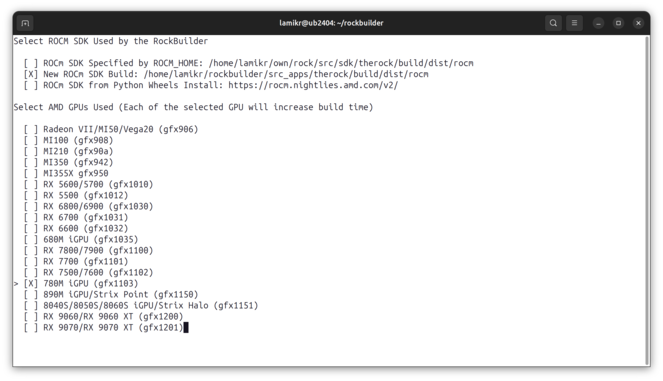

# RockBuilder

Rockbuilder provides an easy way to integrate AI applications to AMD's ROCM SDK.

It is a configuration file based method of building one or multiple external applications on top of the ROCM SDK installation.

Rockbuilder can either use the ROCM SDK install, build it from the source or install it from the pythoin wheels for the selected AMD GPUs.

RockBuilder supports both the Linux and Windows for building the applications.

# Usage

## Download RockBuilder

```
git clone https://github.com/roCm/rockbuilder
```

## ROCM SDK and Target GPU Configuration

Initialize and activate the python virtual environment with all python dependencies that the rockbuilder will need on Linux terminal prompt:

```
cd rockbuilder
source ./init_rcb_env.sh
```

On Windows x86_64 visual studio command prompt must be opened to execute a similar type of command: 

```
cd rockbuilder
init_rcb_env.bat
```

Here the init_rcb_env script will check if the python virtual environment is active. If not it will initialize and activate one to **.venv-directory** and install there all the python applications that rockbuilder will need.

After the python virtual environment has been activated, you can start the rockbuilder.

```
python rockbuilder.py
```

On the first run the rockbuilder will notice that the rockbuilder.cfg configuration file does not yet exist and will therefore show the rockbuilder configuration view to select the ROCM SDK install method and target GPUs.

[](docs/pics/readme/cfg_new_build_60pct.png)

Selection of GPUs depends from the ROCM_SDK install type. When ROCM_SDK is selected to be build, all of the supported AMD GPUs are shown. If the ROCM SDK is instead selected to be installed from the python wheels, the list of GPUs is little different because some of the GPUs does not yet have python wheels and in some cases support for multiple similar generation GPUs have been build to same python wheel package:

[](docs/pics/readme/cfg_python_wheel_60pct.png)

After you make the selections and press enter to confirm them, ROCM SDK configuration is saved to rockbuilder.cfg file.

rockbuilder will then use the configuration file to check whether it needs to build or install the ROCM SDK for the selected target GPUs to your system before starting to use it to build other applications. Note that the building of ROCM SDK may provide more customization than install but the build process itself will last from one hour to hours dependending from your computer. 

## ## Building an Application Set

In many cases there is multiple applications that needs to be build to achieve some functionality. This is handled by the rockbuilder by listing all of the related applications with their correct versions in the **.apps-file.**

Example usage to build the pytorch nightly and all of it's dependencies: 

```
./rockbuilder.py apps/pytorch_nightly.apps
```

This will download, configure and build all applications that are specified in the **pytorch_nightly.apps** file.

```apps/pytorch_nightly.apps
[apps]
app_list=
    deps_common
    pytorch_aotriton_nightly
    triton_pytorch_nightly
    pytorch_nightly
    pytorch_vision_nightly
    pytorch_torchcodec_nightly
    pytorch_audio_nightly
```

Applications are build and installed in the order specified in this file. Each of the application build will be installed to currently active python virtual environment. If there is some other libraries and executables build by the cmake, they will be installed to the configured rocm-sdk.

Python wheels that are build will also be copied to directory **packages/wheels** under rockbuilder.

## Building Applications One By One

Instead of building a set of applications it would be also possible to build them one by one as a single applications in right dependency order.

```
./rockbuilder.py apps/deps_common.cfg
./rockbuilder.py apps/pytorch_aotriton_nightly.cfg
./rockbuilder.py apps/triton_pytorch_nightly.cfg
./rockbuilder.py apps/pytorch_nightly.cfg
./rockbuilder.py apps/pytorch_vision_nightly.cfg
./rockbuilder.py apps/pytorch_torchcodec_nightly.cfg
./rockbuilder.py apps/pytorch_audio_nightly.cfg
```

Each of these cfg-files provides an application specific configuration. Configuration files specify the application name, version, source code checkout address and required configure, build and install commands.

Configuration file format is specified in [CONFIG.md](CONFIG.md) document.

## Testing the Applications Build

Rockbuilder has simple example applications to verify that the pytorch build itself has succeeded. Here we assume that tests are run from another new terminal window and therefore we will activate the python virtual environment firts. If it is already active, we could skip this command:

```
source ./init_rcb_env.sh 
```

Thenpython examples/torch_gpu_hello_world.py  we will execute the example application itself:

```
python examples/torch_gpu_hello_world.py 
```

If success, this application should print out following type of text to terminal.

```
Pytorch version: 2.8.0
ROCM HIP version: 7.1.25441-b9b1250
cuda device count: 2
default cuda device name: AMD Radeon Pro W7900 Dual Slot
device type: cuda
Tensor training running on cuda: True
Running simple model training test
    tensor([0., 1., 2.], device='cuda:0')
Hello World, test executed succesfully
```

Example output from test apps in Windows when using the AMD Radeon W7900 GPU:

```bash
(.venv) D:\rockbuilder\examples>python torch_gpu_hello_world.py
Pytorch version: 2.7.0
ROCM HIP version: 6.5.25222-1f8e4aaca
cuda device count: 1
default cuda device name: AMD Radeon PRO W7900 Dual Slot
device type: cuda
Tensor training running on cuda: True
Running simple model training test
    tensor([0., 1., 2.], device='cuda:0')
Hello World, test executed succesfully

(.venv) D:\rockbuilder\examples>python torch_vision_hello_world.py
pytorch version: 2.7.0
pytorch vision version: 0.22.0

(.venv) D:\rockbuilder\examples>python torch_audio_hello_world.py
pytorch version: 2.7.0
pytorch audio version: 2.7.0
```

You can also test the flash-attention support from the pytorch with this example application:

```
python examples/torch_attention_check.py
```

# Other Rockbuilder Usage Examples

Rockbuilder can also take optional build arguments.

## Checkout Only the Source Code

This will show how to checkout the source code for the pytorch 2.8 related applications without building them.  Source code would be checked out to directory `src_apps`

```bash
python rockbuilder.py --checkout apps/pytorch_28_amd.apps
```

Source code for each project would be checked out under the di

## Checkout Source Code to Custom Directory

```bash
python rockbuilder.py --checkout --src-base-dir custom_src_location apps/pytorch_28_amd.apps
```

Source code for each project would be checked out under the directory `custom_src_location` instead of using the src_apps.

## Build and Install Python Wheel to Custom Directory

In this example we build and install only the pytorch audio and
copy the produced pytorch audio wheel to directory "test" instead of using default "packages/wheels"
Note that pytorch audio requires that pytorch itself has been built and installed first.

```bash
python rockbuilder.py apps/pytorch_audio.cfg --output-dir test
```

## Checkout Single Application Source Code to Custom directory

```bash
python rockbuilder.py --checkout apps/pytorch_audio.cfg --src-dir src_prj/py_audio
```

Source code would be checked out to directory `src_prj/py_audio`:

## Checkout custom pytorch_audio version

This would checkout the v2.6.0 version instead of the version specified in the pytorch_audio.cfg file

```bash
python rockbuilder.py --checkout pytorch_audio --pytorch_audio-version=v2.6.0
```

## Execute only the Install Phase for Previously build Pytorch audio

Note that pytorch audio requires that pytorch has been built and installed first.

```bash
python rockbuilder.py --install apps/pytorch_audio.cfg
```

# Adding a new application to RockBuilder

There exist two types of configuration files that are stored in the applications directory.

## Project list configuration files

apps/core.apps is an example of project list configuration file.

Project list configuration files are used to define a list of applications
that are build by the RockBuilder. For now the RockBuilder is hardcoded
to always use the apps/core.apps to check the appliation list but
in the future the functionality can be extended to allow having multiple
different project lists.

core.apps example:

```bash
[apps]
app_list=
    pytorch
    pytorch_vision
    pytorch_audio
```

## Project specific configuration files

apps/pytorch.cfg is an example from the project configuration file.

Project configuration file specifies actions that RockBuilder executes for the project:

- inut
- checkout
- clean
- pre-configure
- configure
- post-configure
- build
- install
- post-install

By default the RockBuilder executes init, checkout, pre-configure, configure, post-configure, build, install and post-install phases for the application. This can be changed
by specifying the command phase that is wanted to execute. For example:

```bash
python rockbuilder.py --checkout apps/pytorch.cfg
```
