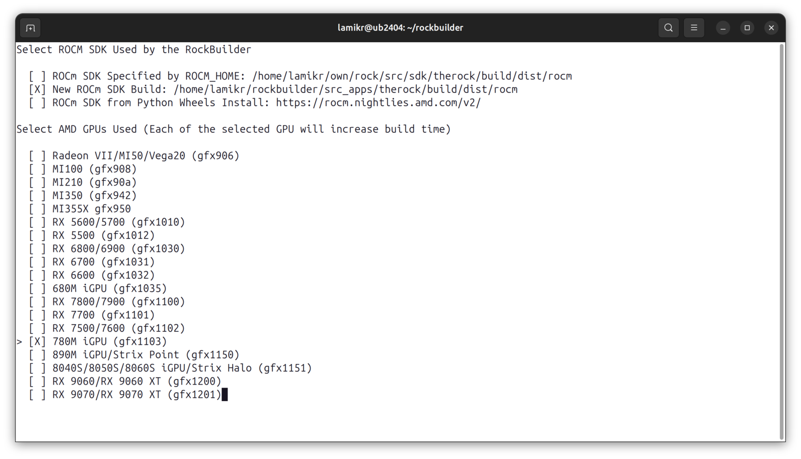
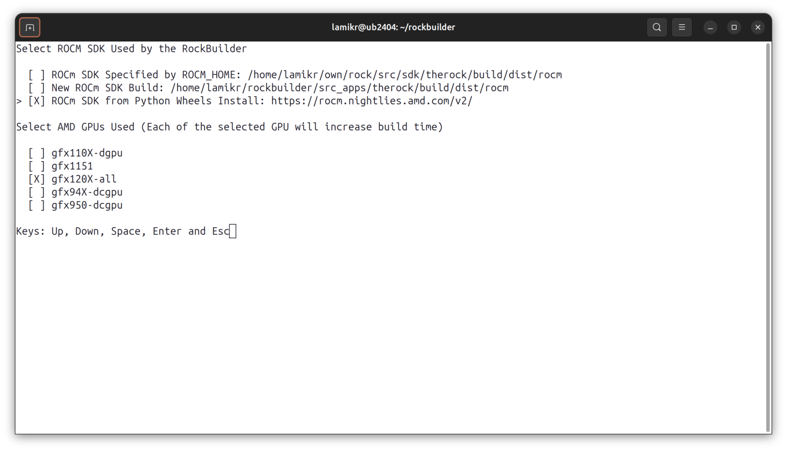

# RockBuilder

RockBuilder is a configuration-based build system that simplifies the process of integrating and building one or multiple AI applications on top of AMD’s ROCm SDK. 

[TheRock](https://github.com/ROCm/TheRock) provides the official ROCm images, while RockBuilder supports building additional applications on top of the ROCm SDK that are not tightly integrated with TheRock. RockBuilder is mainly targeted at developers and users who want to add support for building or using these additional applications.

> **Note:** RockBuilder currently supports all stable ROCm versions from TheRock where applicable.

RockBuilder can use:

- An existing ROCm SDK installation.

- A new ROCm SDK, either:

    - Built from source, or

    - Installed from Python wheels.

RockBuilder supports both Linux and Windows for building the applications.

>**Note:** Windows support is still less tested compared to Linux. You may encounter issues that haven’t been fully validated yet.

## Download RockBuilder

```
git clone https://github.com/roCm/rockbuilder
```

## Rockbuilder Initialization

Initialize and activate the Python virtual environment with all Python dependencies required by RockBuilder.

- Linux (Ubuntu 24.04):

    ```bash
    cd rockbuilder
    source ./init_rcb_env.sh
    ```

- Windows (x86_64, Visual Studio Command Prompt):

    ```bat
    cd rockbuilder
    init_rcb_env.bat
    ```

On Linux, the script **must be sourced** (`source ./init_rcb_env.sh`), not executed directly.

The `init_rcb_env` script checks whether a Python virtual environment is already active. If not, it creates and activates one in the **`.venv`** directory and installs the packages from `requirements.txt`.

Run `source ./init_rcb_env.sh` again in any new terminal before using RockBuilder.

## Rockbuilder Configuration

Configuration is stored in **`rockbuilder.cfg`** at the RockBuilder root. This file records:

- which ROCm SDK RockBuilder should use (local build, existing install, or Python wheels), and
- which AMD GPU target(s) to build for.

Configuration is separate from initialization. Init sets up Python; config selects the ROCm SDK source and GPU targets.

### Interactive configuration

After the virtual environment is active, run RockBuilder without an application config file:

```bash
python rockbuilder.py --help
```

If `rockbuilder.cfg` does not exist, RockBuilder launches an interactive UI to choose the ROCm SDK source and GPU target(s):

- **Build TheRock 10.0** — build the `release/therock-10.0` branch.
- **Build TheRock development main branch** — build the selected `main`
  revision into a version-and-hash-specific install directory.
- **Existing ROCm SDK** — select any valid SDK directory discovered directly
  below `/opt/rcb` or `~/rcb`.
- **ROCm SDK Specified by ROCM_HOME** — use the valid SDK selected by the
  environment variable.

    

- **ROCm SDK from Python Wheels** — install from nightly wheels (lists GPUs with available packages).

    

The interactive UI is an ordered wizard:

1. Select the ROCm SDK, then choose **Forward**.
2. Select one or more compatible GPU targets.
3. For selected `gfx906`, `gfx908`, `gfx90a`, `gfx942`, and `gfx950`
   targets, optionally select Plain, XNACK-, XNACK+, or both explicit
   variants.
4. For a TheRock build, select Normal, Host ASAN, or the combined host
   and device ASAN mode.

Pages which do not apply to the selected SDK or GPUs are skipped. The
combined ASAN option dynamically lists the selected GPUs that receive
device ASAN; every selected GPU receives host ASAN. Device ASAN requires
`gfx906`, `gfx90a`, `gfx942`, or `gfx950` and converts its Plain target to
XNACK+. Host ASAN does not change GPU targets.

Use **Space** to change a selection. When the selection list has focus,
**Enter** moves focus to Forward or Save without changing the selection.
Press Enter again to activate that button. **Tab** changes focus and
**Left/Right** selects a button. The **C/F/B/S** keys activate Cancel,
Forward, Back, and Save directly. **Esc** also cancels. Back and Forward
preserve unsaved selections; only Save writes `rockbuilder.cfg`.

For example, selecting both explicit modes for `gfx90a` stores:

```ini
[build_targets]
gpus = ['gfx90a:xnack-', 'gfx90a:xnack+']
```

Sanitizer selections are stored separately:

```ini
[build_options]
therock_sanitizer = ['ASAN']
```

Sanitized TheRock SDKs use distinct install identities. For example, release
builds use `rocm_10_0_0_asan` or `rocm_10_0_0_host_asan`, and development
builds add the same suffix after their revision hash.

### Manual configuration (headless / automation)

In non-interactive environments (CI, remote shells, AI agents), create or edit `rockbuilder.cfg` directly instead of using the UI.

**New ROCm SDK build** (TheRock built by RockBuilder), targeting MI210 (`gfx90a`):

```ini
[rocm_sdk]
rocm_sdk_build_config = ['therock_10_0']

[build_targets]
gpus = ['gfx90a']
```

The 10.0 build uses `src_apps/therock_10_0`, `build/therock_10_0`, and installs
to `/opt/rcb/rocm_10_0_0` when writable or `~/rcb/rocm_10_0_0` otherwise.
RockBuilder adds the resolved `rocm_sdk_build` path after installation.

To build TheRock `main`, use:

```ini
[rocm_sdk]
rocm_sdk_build_config = ['therock_dev']

[build_targets]
gpus = ['gfx90a']
```

Development builds use `src_apps/therock_dev` and `build/therock_dev`. The
install directory includes the full ROCm version from `version.json` and the
short revision from `RCB_TAG_CHECKOUT`, for example
`/opt/rcb/rocm_dev_10_1_0_a1b2c3d`.

The development checkout is updated only when explicitly requested:

```bash
python rockbuilder.py apps/therock_dev.cfg --checkout
python rockbuilder.py apps/therock_dev.cfg
```

Old development installations are retained. RockBuilder does not create or
update a `rocm_dev` symlink.

**ROCm SDK from Python wheels** (example):

```ini
[rocm_sdk]
rocm_sdk_whl_server = ['https://rocm.nightlies.amd.com/v2/']
rocm_sdk_whl_version = 7.13.0a20260501

[build_targets]
gpus = ['gfx90a']
```

**Use an existing ROCm SDK install**:

```ini
[rocm_sdk]
rocm_sdk_home = ['/opt/rocm']

[build_targets]
gpus = ['gfx90a']
```

### Verify configuration

With the virtual environment active and `rockbuilder.cfg` in place:

```bash
python rockbuilder.py --help
```

This should print usage text without launching the configuration UI.

> **Note:** Init and config do **not** build the ROCm SDK. The SDK is built or installed later, when you run RockBuilder to build therock or other applications. A local ROCm SDK build can take one to several hours depending on your system.

## Build an Application Set

In many cases, multiple applications need to be built to achieve full functionality. RockBuilder handles this by listing all related applications and their corresponding versions in an `.apps` file.

Example usage to build PyTorch nightly and its dependencies:

```
./rockbuilder.py apps/pytorch_nightly.apps
```

This will download, configure, and build all applications that are specified in the `pytorch_nightly.apps` file.

```apps/pytorch_nightly.apps
[apps]
app_list=
    deps_common
    pytorch_aotriton_nightly
    triton_pytorch_nightly
    pytorch_nightly
    pytorch_vision_nightly
    pytorch_torchcodec_nightly
    pytorch_audio_nightly
```

Applications are built and installed in the listed order above. Each application will be installed into the currently active Python virtual environment. Any additional libraries or executables built by CMake will be installed to the configured ROCm SDK.

Built Python wheels are copied below `packages/whl` using this layout:

```text
<rocm-sdk-id>/<gpu-targets>/<application>/<wheel>
```

For example:

```text
packages/whl/rocm_dev_10_1_0_4144ab3/gfx90a/torch/torch-....whl
```

The SDK identifier matches the resolved `ROCM_HOME` installation directory
name. GPU targets are sorted and combined into one directory name for
multi-GPU builds. Existing wheel directories are not migrated.

## Build Applications One By One

Instead of building a set of applications, you can also build them one by one in the correct dependency order.

```
./rockbuilder.py apps/deps_common.cfg
./rockbuilder.py apps/pytorch_aotriton_nightly.cfg
./rockbuilder.py apps/triton_pytorch_nightly.cfg
./rockbuilder.py apps/pytorch_nightly.cfg
./rockbuilder.py apps/pytorch_vision_nightly.cfg
./rockbuilder.py apps/pytorch_torchcodec_nightly.cfg
./rockbuilder.py apps/pytorch_audio_nightly.cfg
```

Each of these `.cfg` files provides an application-specific configuration. These files define the application name, version, source repository, and the commands required to configure, build, and install the application.

Configuration file format is specified in [CONFIG.md](CONFIG.md).

## Test the Applications Build

RockBuilder includes simple example applications to verify that the PyTorch build was successful. If you are running the tests from a new terminal window, you’ll need to activate the Python virtual environment first. If it’s already active, you can skip this step:

```
source ./init_rcb_env.sh 
```

Then, run the example application itself with the following command:

```
python examples/torch_gpu_hello_world.py 
```

If successful, the application should print output similar to the following in the terminal:

```
Pytorch version: 2.8.0
ROCM HIP version: 7.1.25441-b9b1250
cuda device count: 2
default cuda device name: AMD Radeon Pro W7900 Dual Slot
device type: cuda
Tensor training running on cuda: True
Running simple model training test
    tensor([0., 1., 2.], device='cuda:0')
Hello World, test executed succesfully
```

Example output from the test applications on Windows using the AMD Radeon W7900 GPU:

```bash
(.venv) D:\rockbuilder\examples>python torch_gpu_hello_world.py
Pytorch version: 2.7.0
ROCM HIP version: 6.5.25222-1f8e4aaca
cuda device count: 1
default cuda device name: AMD Radeon PRO W7900 Dual Slot
device type: cuda
Tensor training running on cuda: True
Running simple model training test
    tensor([0., 1., 2.], device='cuda:0')
Hello World, test executed succesfully

(.venv) D:\rockbuilder\examples>python torch_vision_hello_world.py
pytorch version: 2.7.0
pytorch vision version: 0.22.0

(.venv) D:\rockbuilder\examples>python torch_audio_hello_world.py
pytorch version: 2.7.0
pytorch audio version: 2.7.0
```

You can also test the flash-attention support in PyTorch with the following example application:

```
python examples/torch_attention_check.py
```

## Other RockBuilder Usage Examples

RockBuilder also supports optional build arguments as follows:

### Checkout Only the Source Code

This command checks out the source code for the PyTorch 2.8–related applications without building them. The source code will be checked out to the `src_apps` directory.

```bash
python rockbuilder.py --checkout apps/pytorch_28_amd.apps
```

### Checkout Source Code to a Custom Directory

This command checks out the source code for each project to the `custom_src_location` directory instead of the default `src_apps` directory.

```bash
python rockbuilder.py --checkout --src-base-dir custom_src_location apps/pytorch_28_amd.apps
```

### Build and Install Python Wheel to a Custom Directory

This command builds and installs only PyTorch Audio and uses `test` instead of
the default `packages/whl` directory as the artifact output base.

>**Note:** PyTorch Audio requires PyTorch to be built and installed first.

```bash
python rockbuilder.py apps/pytorch_audio.cfg --output-dir test
```

The resulting wheel is copied to:

```text
test/<rocm-sdk-id>/<gpu-targets>/torchaudio/<wheel>
```

### Checkout the Source Code of a Single Application to a Custom Directory

This command checks out the source code of a single application to the `src_prj/py_audio` directory.

```bash
python rockbuilder.py --checkout apps/pytorch_audio.cfg --src-dir src_prj/py_audio
```

### Checkout a Custom Version

This command checks out the source code of PyTorch Audio version `2.6.0` instead of the version specified in the `pytorch_audio.cfg` file.

```bash
python rockbuilder.py --checkout pytorch_audio --pytorch_audio-version=v2.6.0
```

### Execute Only the Install Phase

This command executes only the install phase for a previously built PyTorch Audio.

>**Note:** PyTorch Audio requires PyTorch to be built and installed first.

```bash
python rockbuilder.py --install apps/pytorch_audio.cfg
```

## Add a New Application to RockBuilder

RockBuilder uses two types of configuration files stored under the applications directory.

### Application Set Configuration File

`apps/core.apps` is an example of an application set configuration file, listing applications that RockBuilder can build:

```bash
[apps]
app_list=
    pytorch
    pytorch_vision
    pytorch_audio
```

### Application Configuration File

`apps/pytorch.cfg` is an example of an application configuration file, defining the actions that RockBuilder executes for a specific project, including:

- inut
- checkout
- clean
- pre-configure
- configure
- post-configure
- build
- install
- post-install

By default the RockBuilder executes init, checkout, pre-configure, configure, post-configure, build, install, and post-install phases for the application. You can override this by specifying the desired command phase. For example:

```bash
python rockbuilder.py --checkout apps/pytorch.cfg
```
